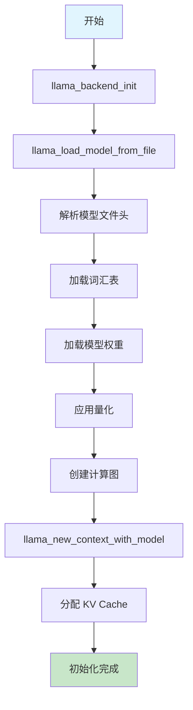
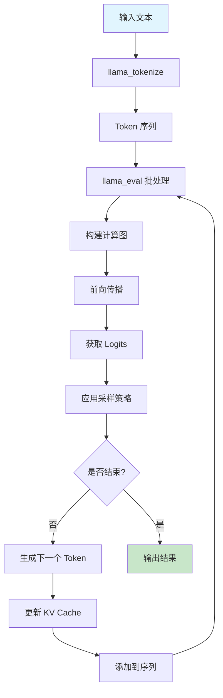
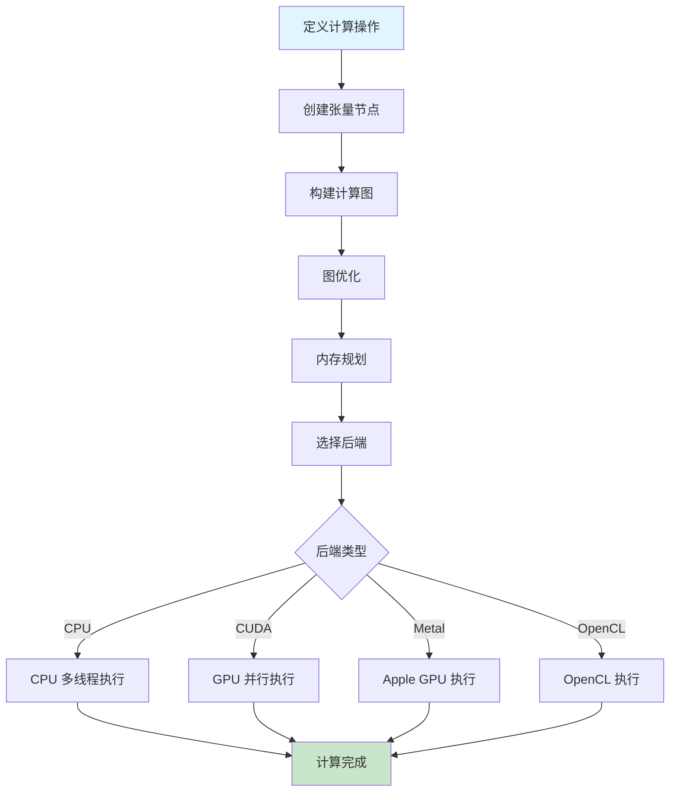
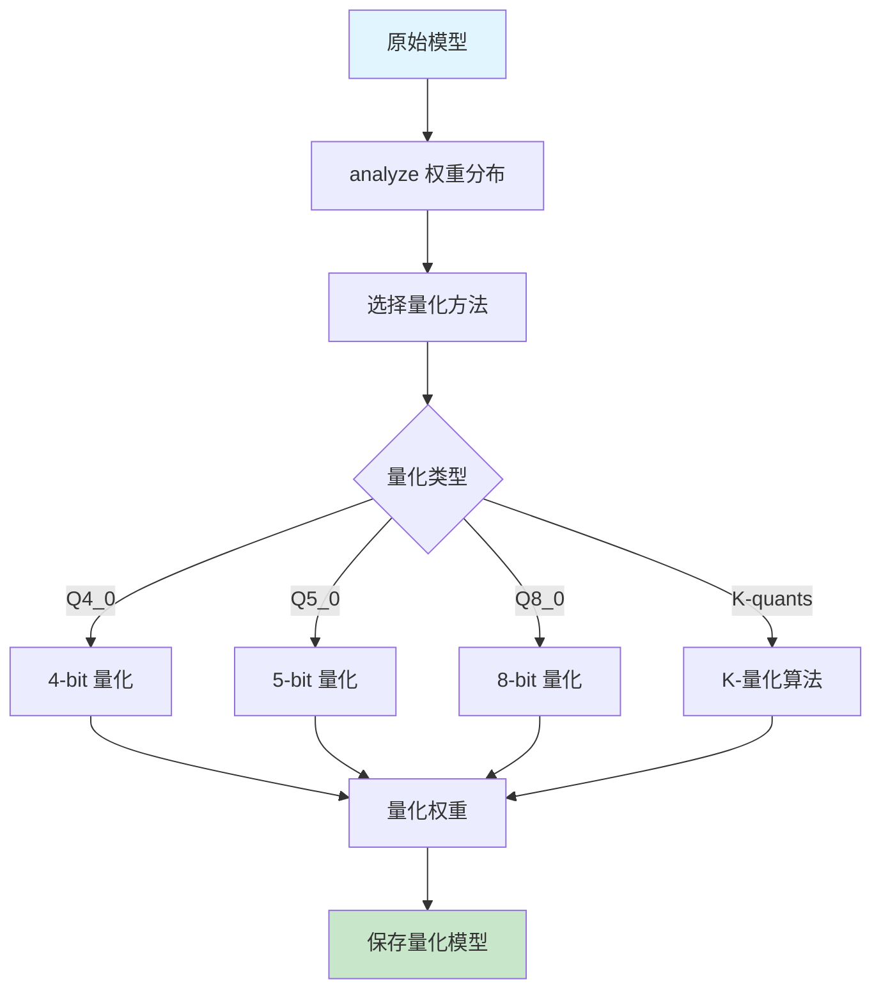

# llama.cpp 代码库分析

## 项目概述

llama.cpp 是一个用纯 C/C++ 实现的 LLaMA (Large Language Model Meta AI) 模型推理框架。该项目的主要目标是在消费级硬件上高效运行大型语言模型，支持 CPU、GPU、Metal 等多种计算后端。

## 核心架构

### 1. 主要组件层次

```
┌─────────────────────────────────────────────────────┐
│                应用层 (Examples)                    │
├─────────────────────────────────────────────────────┤
│              高级 API 层 (llama.h/.cpp)             │
├─────────────────────────────────────────────────────┤
│            计算图引擎 (ggml.h/.cpp)                  │
├─────────────────────────────────────────────────────┤
│     硬件后端 (CUDA/Metal/OpenCL/CPU)                │
└─────────────────────────────────────────────────────┘
```

### 2. 核心文件结构

- **llama.h/cpp**: 主要 LLaMA 模型 API 和实现
- **ggml.h/cpp**: 通用机器学习计算图库
- **k_quants.h/cpp**: 量化算法实现
- **convert.py**: 模型格式转换工具
- **examples/**: 各种使用示例和工具

## 主要流程图

### 1. 模型加载和初始化流程



### 2. 文本生成推理流程



### 3. GGML 计算图执行流程



### 4. 模型量化流程



## 核心 API 接口

### 1. 模型管理 API

```c
// 初始化后端
void llama_backend_init(bool numa);

// 加载模型
struct llama_model * llama_load_model_from_file(
    const char * path_model,
    struct llama_context_params params
);

// 创建上下文
struct llama_context * llama_new_context_with_model(
    struct llama_model * model,
    struct llama_context_params params
);

// 释放资源
void llama_free(struct llama_context * ctx);
void llama_free_model(struct llama_model * model);
```

### 2. 推理 API

```c
// Token 化
int llama_tokenize(
    struct llama_context * ctx,
    const char * text,
    llama_token * tokens,
    int n_max_tokens,
    bool add_bos
);

// 执行推理
int llama_eval(
    struct llama_context * ctx,
    const llama_token * tokens,
    int n_tokens,
    int n_past,
    int n_threads
);

// 获取输出
float * llama_get_logits(struct llama_context * ctx);
```

### 3. 采样 API

```c
// 各种采样策略
void llama_sample_top_k(struct llama_context * ctx, 
                       llama_token_data_array * candidates, 
                       int k, size_t min_keep);

void llama_sample_top_p(struct llama_context * ctx, 
                       llama_token_data_array * candidates, 
                       float p, size_t min_keep);

llama_token llama_sample_token(struct llama_context * ctx, 
                              llama_token_data_array * candidates);
```

## 关键特性

### 1. 量化支持
- **多种量化精度**: Q4_0, Q4_1, Q5_0, Q5_1, Q8_0
- **K-quants**: 先进的量化算法，平衡精度和性能
- **混合精度**: 关键层保持高精度，其他层量化

### 2. 硬件加速
- **CUDA**: NVIDIA GPU 支持
- **Metal**: Apple GPU 支持  
- **OpenCL**: 通用 GPU 支持
- **多线程 CPU**: 高效的 CPU 并行计算

### 3. 内存优化
- **内存映射**: 减少内存占用
- **KV Cache**: 高效的键值缓存机制
- **动态上下文**: 支持长文本处理

### 4. 模型支持
- **LLaMA 系列**: LLaMA-7B, 13B, 30B, 65B
- **其他模型**: Alpaca, Vicuna, GPT4All 等
- **自定义模型**: 支持模型转换和适配

## 使用示例流程

### 1. 基本使用流程

```c++
// 1. 初始化
llama_backend_init(false);

// 2. 设置参数
auto params = llama_context_default_params();
params.n_ctx = 2048;
params.n_gpu_layers = 32;

// 3. 加载模型
auto model = llama_load_model_from_file("model.bin", params);
auto ctx = llama_new_context_with_model(model, params);

// 4. Token化输入
std::vector<llama_token> tokens;
int n_tokens = llama_tokenize(ctx, prompt.c_str(), tokens.data(), 
                             tokens.size(), true);

// 5. 执行推理
llama_eval(ctx, tokens.data(), n_tokens, 0, n_threads);

// 6. 获取结果并采样
auto logits = llama_get_logits(ctx);
auto next_token = sampling_function(logits);

// 7. 清理
llama_free(ctx);
llama_free_model(model);
```

## 性能优化要点

### 1. 模型量化
- 根据精度需求选择合适的量化级别
- 关键层保持高精度，其他层激进量化

### 2. 硬件利用
- GPU 层数分配优化
- 批处理大小调整
- 多线程配置

### 3. 内存管理
- 启用内存映射减少 RAM 使用
- 合理配置上下文大小
- KV Cache 优化

### 4. 计算优化
- 选择合适的后端
- 批量处理 Token
- 预分配内存缓冲区

## 总结

llama.cpp 是一个高度优化的 LLaMA 模型推理框架，具有以下优势：

1. **高性能**: 通过量化、硬件加速等技术实现高效推理
2. **跨平台**: 支持多种操作系统和硬件平台
3. **易用性**: 提供简洁的 C API 和丰富的示例
4. **可扩展**: 模块化设计，易于添加新功能
5. **资源友好**: 在有限硬件上运行大模型

该框架特别适合在边缘设备、个人电脑等资源受限环境中部署大型语言模型。